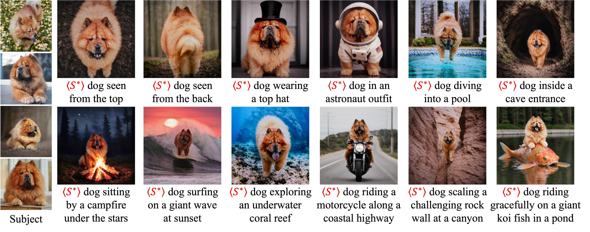

# Fine-Tuning Visual Autoregressive Models for Subject-Driven Generation (ICCV 2025)


[**Paper (Arxiv)**](https://arxiv.org/abs/2504.02612) / [**Project Page**](https://jiwoogit.github.io/ARBooth)



This is the official PyTorch implementation for the paper "Fine-Tuning Visual Autoregressive Models for Subject-Driven Generation".

---

## Status Checklist

- [x] Code & checkpoint upload completed
- [ ] FlexAttention finetuning option enabled
- [ ] Infinity-8B checkpoint finetuning enabled

---

## Overview

We introduce a method for fine-tuning visual autoregressive (VAR) models tailored for subject-driven generation tasks. Our approach efficiently customizes VAR models, enabling high-quality personalized image generation.

## Hardware Requirements

Our experiments were conducted using a NVIDIA A6000 GPU. Please ensure your hardware meets the following minimum specification:

* GPU Memory: **≥ 40GB**

## Installation

### Option 1: Manual Setup

Clone the repository and install dependencies:

```bash
git clone https://github.com/jiwoogit/ARBooth.git
cd arbooth
pip install -r requirements.txt
```

### Option 2: Docker Setup

Use our pre-configured Docker image:

```bash
docker pull wldn0202/arbooth:latest
```

Docker Hub link: [Docker Image](https://hub.docker.com/repository/docker/wldn0202/arbooth/general)

## Pretrained Checkpoints

Please download the official pretrained VAR checkpoints from [Infinity's repository](https://github.com/FoundationVision/Infinity/tree/main) and organize them as follows:

```
weights/
├── infinity_2b_reg.pth
└── infinity_vae_d32_reg.pth
```

**You can download our fine-tuned checkpoints from [Hugging Face (wldn0202/ARBooth)](https://huggingface.co/wldn0202/ARBooth).**

## Data Preprocessing

We adopt the preprocessing pipeline of [DreamMatcher](https://github.com/cvlab-kaist/DreamMatcher). Please follow their instructions for detailed steps or refer `inputs` directory.

## Training

Customize training parameters by modifying `exp_name` and `cls_name` in the provided script:

```bash
bash scripts/train_arbooth.sh
```

All training results and logs will be saved under the `LOCAL_OUT` directory.

For detailed configuration options and parameters for fine-tuning, please refer to `infinity/utils/arg_util.py`.

## Evaluation

We evaluate performance using metrics: DINO, CLIP, PRES, and DIV. Update the paths in `scripts/eval_arbooth.sh` to match your training setup:

```bash
bash scripts/eval_arbooth.sh
```

## Inference

Generate images using your custom prompts with the fine-tuned checkpoints:

```bash
bash scripts/infer_arbooth.sh
```

## Fine-tuning Tips

- **Iteration Settings**: 
  - For 2-batch configuration: 500 iterations is recommended
  - For 1-batch configuration: 100-150 iterations is recommended
  - Adjust these values based on your specific input data and requirements

- **Class Prompt Selection**:
  - The choice of class prompt (e.g., "dog", "cat") significantly impacts the final generation quality
  - Use general, broad category nouns for optimal results

## Acknowledgements

This repository is built upon the following projects:

* [VAR (FoundationVision/VAR)](https://github.com/FoundationVision/VAR)
* [Infinity (FoundationVision/Infinity)](https://github.com/FoundationVision/Infinity/tree/main?tab=readme-ov-file)
* [DreamMatcher (cvlab-kaist/DreamMatcher)](https://github.com/cvlab-kaist/DreamMatcher)
* [diffusers (huggingface/diffusers)](https://github.com/huggingface/diffusers)

We sincerely appreciate their invaluable contributions.

## Citation

If our paper or repository assists your research, kindly cite us:

```bibtex
@article{chung2025fine,
  title={Fine-Tuning Visual Autoregressive Models for Subject-Driven Generation},
  author={Chung, Jiwoo and Hyun, Sangeek and Kim, Hyunjun and Koh, Eunseo and Lee, MinKyu and Heo, Jae-Pil},
  journal={arXiv preprint arXiv:2504.02612},
  year={2025}
}
```

## Contact

For any questions, please reach out to:

* Jiwoo Chung ([jiwoo.jg@gmail.com](mailto:jiwoo.jg@gmail.com))
